  

---

  Dione Lima 👋 | Postgrad in Offensive & Defensive Security | CEH v12 • CPTE • CSAE • CNSE 
  Focused on pentesting, resilient architectures, and network defense for corporate security.

 

  

 

 

<table>
<tr>
<td align="center" width="50%">
<strong>Contribution Streak</strong>
  

</td>

<td align="center" width="50%">
<strong>Never stop learning</strong>
  

</td>
</tr>
</table>

 

<h3 align="left">GitHub Stats</h3>

  

 

<picture align="center">
  <source media="(prefers-color-scheme: dark)" srcset="https://raw.githubusercontent.com/0xdun0/0xdun0/output/github-contribution-grid-snake-dark.svg">
  <source media="(prefers-color-scheme: light)" srcset="https://raw.githubusercontent.com/0xdun0/0xdun0/output/github-contribution-grid-snake-dark.svg">
  
</picture>
